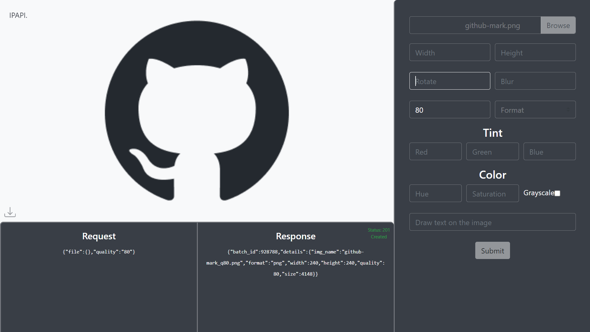
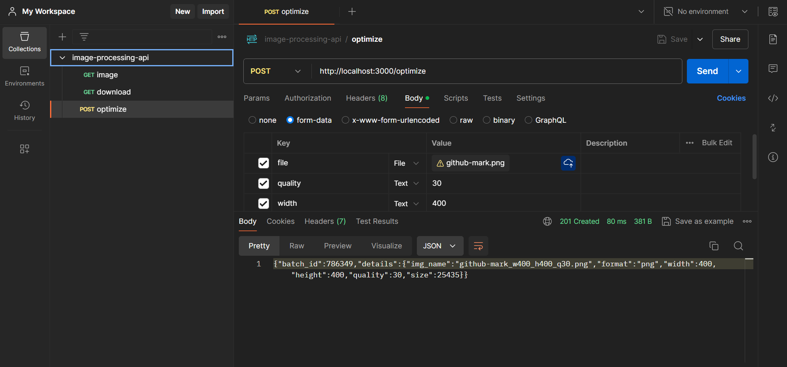
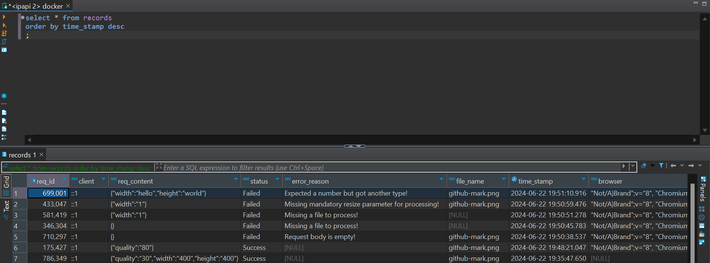
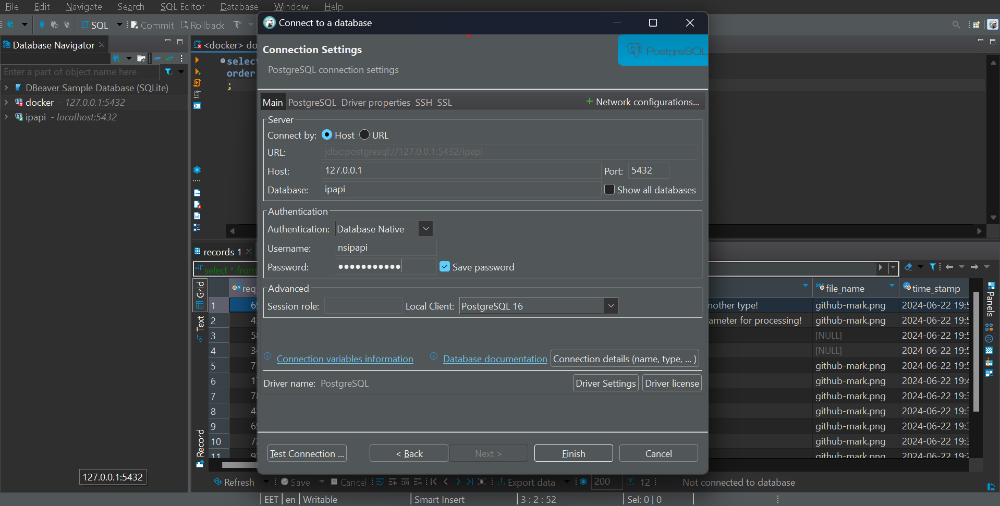
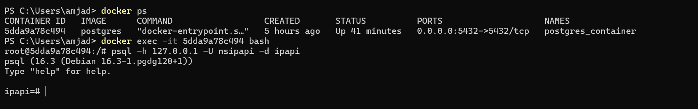
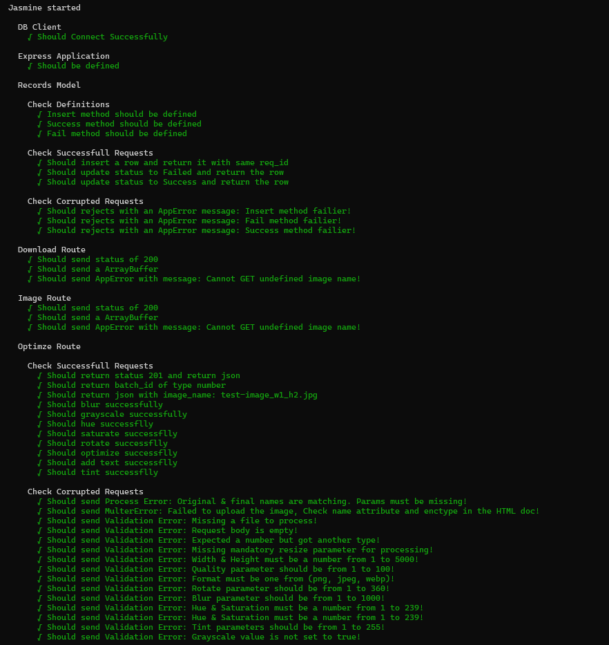

# Image Processing API

[](https://choosealicense.com/licenses/mit/)
[](https://confirm.udacity.com/AKSJPLDY)

Express.js API with PostgreSQL DB integration that performs image processing and logs user's requests.

This project Intensivly Demonstrates:

- Error Handling
- Testing (Integration, End to End, and unit testing)
- Strict typing using TypeScript & ESLint
- Logging
- DB integration
- DB Migration
- Upload & Download

<details><summary><b>Tech Choice</b></summary>

### Postgres

- **Availability**: It is open source and free to use with any project
- **Common**: It is a relational, SQL database which is the most common type of database right now
- **Popular and well-tested**: Postgres is a viral database and a common choice among enterprise software
- **Transferable**: Because Postgres uses SQL, it is entirely transferable to working with a MySQL database or any other SQL database

### Typescript & ESLint

- **Strict**: Maintain more error-prone code with `no-implicit-any` set to true.
- **Reduce Errors**: Using ESLint for syntax errors.

### Winston

- **Maintenance**: Log unexpected server errors.

</details>

## Table of Content

- [Local Environment & Setup](#local-environment--setup)
- [Run Locally](#run-locally)
- [Usage Examples](#usageexamples)
- [API Referance](#api-reference)
- [DB Connection](#db-connection)
- [Running Tests](#running-tests)
- [Running Scripts](#running-scripts)
- [Lessons Learned](#lessons-learned)
- [Challenges](#challenges)
- [Tech Stack](#tech-stack)

## Local Environment & Setup

To run this project, you will need to have the following on your system:

1. Node.js
2. PostgreSQL - Docker image or locally installed.
   There is `docker-compose.yml` already configured for you
3. DBeaver Community or your favorite SQL editor to monitor DB. Alternatively, you can use the psql terminal as documented here [DB Connection](#db-connection)
4. `.env` file with the following environment variables:<br>

```environment variables
   POSTGRES_HOST=127.0.0.1
   POSTGRES_USER=nsipapi
   POSTGRES_DB=ipapi
   POSTGRES_TEST_DB=ipapi_test
   POSTGRES_PASSWORD=password123
   ENV=dev
```

## Run Locally

1. Clone the project

```bash
  git clone https://github.com/amjadelmahdy/image-processing-api.git
```

2. Go to the project directory

```bash
  cd image-processing-api
```

3. Install packages

```bash
  npm install
```

4. Initiate PostgreSQL container

```bash
    docker-compose up
```

5. Run migrations

```bash
    npx db-migrate up
```

6. Start the server

```bash
    npm run start
```

## Usage/Examples

API could be used through Postman or frontend `http://localhost:3000/`<br>
Both are solid ways to display the `HTTP` Request & Response alongside the status code - message

### Frontend UI



### Postman

When using Postman make sure to use form-data as follows:



### DBeaver Community

Using DBeaver Community to query the DB



> [!TIP]
> **Starter Status**: `On-Hold`<br>
> **Unexpected Errors**: Logged inside `logs/file-log-error.log`

## API Reference

### Routes

| Route       | Method | Description                  |
| :---------- | :----- | :--------------------------- |
| `/`         | GET    | Root - Home Page             |
| `/image`    | GET    | Get an Image                 |
| `/download` | GET    | Download an Image            |
| `/optimize` | POST   | Upload and Optimize an Image |

#### Home Page

```http
  GET /
```

#### Get Image

```http
  GET /image/${image_name}
```

| Parameter    | Type     | Description                              |
| :----------- | :------- | :--------------------------------------- |
| `image_name` | `string` | **Required**. Name of the image to fetch |

#### Download Image

```http
  GET /download/${image_name}
```

| Parameter    | Type     | Description                              |
| :----------- | :------- | :--------------------------------------- |
| `image_name` | `string` | **Required**. Name of the image to fetch |

#### Optimize Image

```http
  POST /optimize
```

| Property     | Type      | Description                      |
| :----------- | :-------- | :------------------------------- |
| `width`      | `number`  | Resize width                     |
| `height`     | `number`  | Resize height                    |
| `quality`    | `number`  | Compression quality              |
| `format`     | `string`  | Convert format (png, jpeg, webp) |
| `rotate`     | `number`  | Degrees of rotation              |
| `blur`       | `number`  | Sigma of the Gaussian mask       |
| `hue`        | `number`  | Degree of hue rotation           |
| `saturation` | `number`  | Degree of saturation rotation    |
| `grayscale`  | `boolean` | Convert to black and white       |
| `text`       | `string`  | Draw text on the image           |
| `red`        | `number`  | Red color tint                   |
| `green`      | `number`  | Green color tint                 |
| `blue`       | `number`  | Blue color tint                  |

<br>

> [!TIP]
>
> - None of the properties are required, but you must provide at least one parameter inside `req.body`.
> - The file has to be uploaded.
> - `Width` & `Height` have to be provided together.
> - Properties should have the same type.
> - Must align with the accepted values table below.

#### Accepted Values

| Property     | Type      | Max               | Min |
| :----------- | :-------- | :---------------- | :-- |
| `width`      | `number`  | 5000              | 1   |
| `height`     | `number`  | 5000              | 1   |
| `quality`    | `number`  | 100               | 1   |
| `format`     | `string`  | (png, jpeg, webp) |
| `rotate`     | `number`  | 360               | 1   |
| `blur`       | `number`  | 1000              | 1   |
| `hue`        | `number`  | 239               | 1   |
| `saturation` | `number`  | 239               | 1   |
| `grayscale`  | `boolean` | true              |     |
| `text`       | `string`  | 20 characters     |     |
| `red`        | `number`  | 255               | 0   |
| `green`      | `number`  | 255               | 0   |
| `blue`       | `number`  | 255               | 0   |

## DB Connection

Choose the way you're comfortable with

### Via DBeaver Community

From navbar > Database > New Database Connection > PostgreSQL



### Via psql Terminal

1. Connect to docker postgres-container bash using the following commands

```bash
  docker ps
  docker exec -it container_id bash
  psql -h 127.0.0.1 -U nsipapi -d ipapi
```



2. Now you can:

- List tables using `\dt`<br>
- List databases using `\l`<br>
- Connect to a database using `\c database_name`<br>
- Use the following query: `SELECT * FROM records;`

## Running Tests

To run tests, use the following command:

```bash
  npm run test
```



> [!IMPORTANT]
> Ensure `POSTGRES_TEST_DB=ipapi_test`, or change the name of the test-db in the test script inside `package.json`.

```bash
  "test": "db-migrate db:create test-db && db-migrate --env test up && cross-env ENV=test ts-node node_modules/jasmine/bin/jasmine && db-migrate db:drop test-db"
```

### Explanation of Test Script

1. Creates a test database with a provided name<br>
2. Sets the environment variable `ENV=test` to use the test configuration.<br>
3. Run tests<br>
4. Drops the test database to ensure a clean environment for each test run.

> [!IMPORTANT]
> If the test fails, you might need to drop the test database using the following command: <br>`npx db-migrate db:drop test-db`

## Running Scripts

| Script         | Description                                                 |
| :------------- | :---------------------------------------------------------- |
| `build`        | Compile the project to JavaScript                           |
| `start`        | Start the built JavaScript project                          |
| `dev:start`    | Start the TypeScript source project using ts-node & nodemon |
| `lint`         | ESLint checks for syntax errors                             |
| `lint:fix`     | ESLint checks and fixes syntax errors                       |
| `prettier`     | Consistently organizes code using Prettier                  |
| `prettier:fix` | Run Prettier and ESLint fix together                        |
| `test`         | Run tests before compiling using Jasmine and ts-node        |

## Lessons Learned

- **ESLint and Prettier**: Make them work together using `eslint-plugin-prettier`.
- **Compose Smaller Pieces**: Build smaller components to reach the big picture.
- **Jasmine Tests**: Testing before compilation lacks support.

> [!TIP]
> **Solution**: Use the test script `ts-node node_modules/jasmine/bin/jasmine` to run Jasmine with ts-node instead of a separate package like jasmine-ts.

## Challenges

- **Middleware Testing**: Difficulty with mocking HTTP requests with Jasmine

- **Uncaught Exceptions**: Handling process.on "uncaughtException" at the app level rather than middleware.

#### Future implementations

- Pending requests: Modify and resubmit requests from the backend.

## Tech Stack

**Server:** Node, Express, PostgreSQL, Multer, Sharp, DB-Migrate, Cross-Env, Dotenv, Winston
